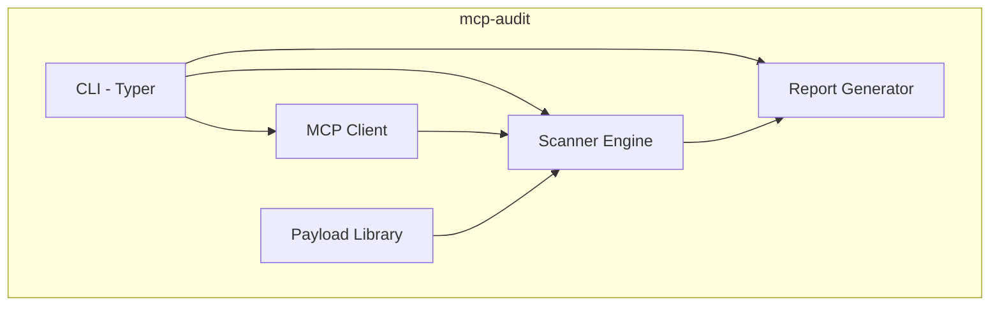
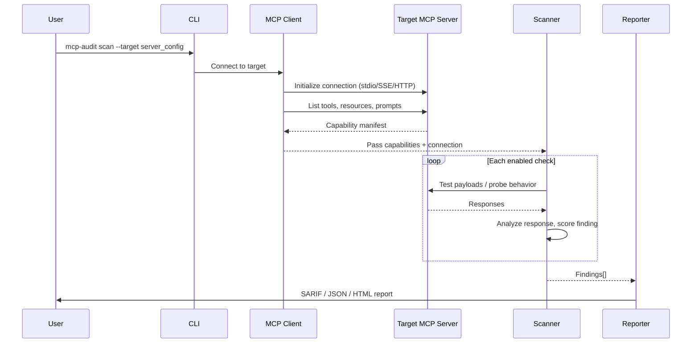
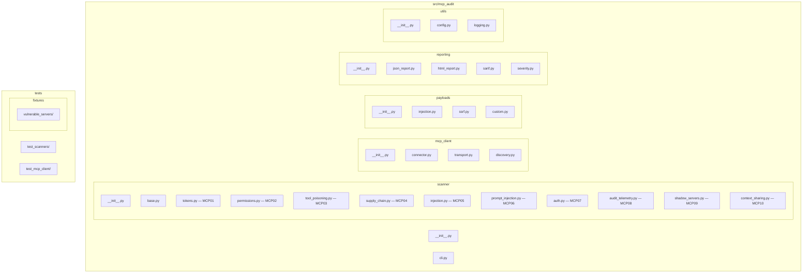

Technical architecture and implementation guide for CounterAgent Phase 1: `mcp-audit`.

---
## Architecture Overview

### Phase 1 (mcp-audit)


### Scanning Flow


---
## Module Structure

### Phase 1


---
## Directory Structure

```
mcp-audit/
├── README.md
├── LICENSE (Apache 2.0)
├── SECURITY.md
├── CONTRIBUTING.md
├── pyproject.toml
├── src/
│   └── mcp_audit/
│       ├── __init__.py
│       ├── cli.py                      # CLI entry point (Typer)
│       ├── scanner/
│       │   ├── __init__.py
│       │   ├── base.py                 # Base scanner class
│       │   ├── tokens.py              # MCP01: Token Mismanagement
│       │   ├── permissions.py         # MCP02: Privilege Escalation
│       │   ├── tool_poisoning.py      # MCP03: Tool Poisoning
│       │   ├── supply_chain.py        # MCP04: Supply Chain
│       │   ├── injection.py           # MCP05: Command Injection
│       │   ├── prompt_injection.py    # MCP06: Prompt Injection
│       │   ├── auth.py               # MCP07: Auth/Authz
│       │   ├── audit_telemetry.py    # MCP08: Audit & Telemetry
│       │   ├── shadow_servers.py     # MCP09: Shadow Servers
│       │   └── context_sharing.py    # MCP10: Context Over-Sharing
│       ├── mcp_client/
│       │   ├── __init__.py
│       │   ├── connector.py           # MCP protocol client
│       │   ├── transport.py           # stdio/SSE/Streamable HTTP
│       │   └── discovery.py           # Server capability enumeration
│       ├── payloads/
│       │   ├── __init__.py
│       │   ├── injection.py           # Command injection payloads
│       │   ├── ssrf.py               # SSRF payloads
│       │   └── custom.py             # User-defined payload support
│       ├── reporting/
│       │   ├── __init__.py
│       │   ├── json_report.py         # Machine-readable JSON output
│       │   ├── html_report.py         # Human-readable HTML report
│       │   ├── sarif.py              # SARIF for CI/CD integration
│       │   └── severity.py           # CVSS-aligned severity scoring
│       └── utils/
│           ├── __init__.py
│           ├── config.py              # Scanner configuration
│           └── logging.py             # Internal logging
├── tests/
│   ├── test_scanners/
│   ├── test_mcp_client/
│   └── fixtures/
│       └── vulnerable_servers/        # Intentionally vulnerable MCP servers
├── docs/
│   ├── usage.md
│   ├── adding_checks.md              # Guide for community contributions
│   └── owasp_mapping.md              # Mapping to OWASP MCP Top 10
└── examples/
    ├── scan_local_server.py
    ├── ci_integration.yaml
    └── custom_payload_example.py
```

---
## Data Models

### Finding
A single vulnerability or issue discovered during a scan.

```python
class Severity(str, Enum):
    CRITICAL = "critical"    # CVSS 9.0-10.0
    HIGH = "high"            # CVSS 7.0-8.9
    MEDIUM = "medium"        # CVSS 4.0-6.9
    LOW = "low"              # CVSS 0.1-3.9
    INFO = "info"            # Informational, no CVSS

class Finding(BaseModel):
    id: str                          # Unique finding identifier
    owasp_id: str                    # OWASP MCP Top 10 reference (e.g., "MCP05")
    title: str                       # Human-readable title
    description: str                 # Detailed description
    severity: Severity               # CVSS-aligned severity
    cvss_score: Optional[float]      # Numeric CVSS score if applicable
    evidence: str                    # What was observed (response, behavior)
    remediation: str                 # How to fix
    tool_name: Optional[str]         # Which MCP tool was affected
    scanner_module: str              # Which scanner module found this
    timestamp: datetime              # When discovered
```

### ScanTarget
Configuration for the MCP server being scanned.

```python
class TransportType(str, Enum):
    STDIO = "stdio"
    SSE = "sse"
    STREAMABLE_HTTP = "streamable_http"

class ScanTarget(BaseModel):
    name: str                        # Human-readable target name
    transport: TransportType         # Connection method
    command: Optional[str]           # For stdio: command to launch server
    args: Optional[list[str]]        # For stdio: command arguments
    url: Optional[str]               # For SSE/HTTP: server URL
    env: Optional[dict[str, str]]    # Environment variables
    headers: Optional[dict[str, str]] # Custom headers for HTTP
```

### ScanResult
Complete results from a scan run.

```python
class ScanResult(BaseModel):
    target: ScanTarget               # What was scanned
    started_at: datetime             # Scan start time
    completed_at: datetime           # Scan end time
    findings: list[Finding]          # All findings
    checks_run: list[str]            # Which scanner modules executed
    checks_skipped: list[str]        # Which were skipped (and why)
    server_info: ServerInfo          # Enumerated server capabilities
```

### ServerInfo
Enumerated capabilities of the target MCP server.

```python
class ServerInfo(BaseModel):
    name: Optional[str]              # Server name from initialization
    version: Optional[str]           # Server version
    tools: list[ToolInfo]            # Available tools
    resources: list[ResourceInfo]    # Available resources
    prompts: list[PromptInfo]        # Available prompts
    transport: TransportType         # How we connected
    capabilities: dict               # Raw capability negotiation result
```

---
## CLI Commands

| Command | Purpose |
|---------|---------|
| `scan` | Run security scan against target MCP server |
| `list-checks` | List available scanner modules and their OWASP mapping |
| `report` | Generate report from saved scan results |
| `enumerate` | Enumerate server capabilities without scanning |

### Scan Options

```
--target, -t      Target config file (YAML/JSON) or inline connection string
--transport       Transport type: stdio, sse, streamable_http (default: stdio)
--command         For stdio: command to launch server
--url             For SSE/HTTP: server URL
--checks          Comma-separated check IDs, or "all" (default: all)
--exclude         Comma-separated check IDs to skip
--severity-min    Minimum severity to report (default: info)
--output, -o      Output file path
--format, -f      Output format: sarif, json, html (default: sarif)
--timeout         Per-check timeout in seconds (default: 30)
--verbose, -v     Verbose output
```

### Usage Examples

```bash
# Scan a stdio-based MCP server
mcp-audit scan --transport stdio --command "python my_server.py"

# Scan an SSE server
mcp-audit scan --transport sse --url http://localhost:8080/sse

# Scan with target config file
mcp-audit scan --target targets/my_server.yaml

# Run only injection and auth checks
mcp-audit scan --target targets/my_server.yaml --checks injection,auth

# Generate HTML report from previous scan
mcp-audit report --input results/scan_2026-02-10.json --format html

# Just enumerate capabilities
mcp-audit enumerate --transport stdio --command "npx my-mcp-server"
```

### Target Config File Format

```yaml
# targets/example_server.yaml
name: "Example MCP Server"
transport: stdio
command: "python"
args: ["path/to/server.py"]
env:
  API_KEY: "test-key-for-scanning"
```

```yaml
# targets/remote_server.yaml
name: "Remote SSE Server"
transport: sse
url: "http://localhost:3000/sse"
headers:
  Authorization: "Bearer test-token"
```

---
## Scanner Module Interface

All scanner modules implement a base class:

```python
from abc import ABC, abstractmethod
from mcp_audit.scanner.base import BaseScanner, Finding

class BaseScanner(ABC):
    """Base class for all scanner modules.

    Each scanner targets one OWASP MCP Top 10 category.
    Scanners receive a connected MCP client and server info,
    then return a list of findings.

    Args:
        client: Connected MCP client instance.
        server_info: Enumerated server capabilities.
        config: Scanner configuration options.
    """

    @property
    @abstractmethod
    def id(self) -> str:
        """Unique scanner identifier (e.g., 'injection')."""

    @property
    @abstractmethod
    def name(self) -> str:
        """Human-readable name."""

    @property
    @abstractmethod
    def owasp_id(self) -> str:
        """OWASP MCP Top 10 reference (e.g., 'MCP05')."""

    @property
    @abstractmethod
    def description(self) -> str:
        """What this scanner checks for."""

    @abstractmethod
    async def scan(self, client, server_info, config) -> list[Finding]:
        """Execute the scan and return findings.

        Args:
            client: Connected MCP client.
            server_info: Server capabilities from enumeration.
            config: Scanner configuration.

        Returns:
            List of Finding objects for any issues discovered.
        """
```

### Adding a New Scanner Module

1. Create `src/mcp_audit/scanner/your_check.py`
2. Implement `BaseScanner` with `id`, `name`, `owasp_id`, `description`, `scan()`
3. Register in `src/mcp_audit/scanner/__init__.py`
4. Add test fixture in `tests/fixtures/vulnerable_servers/` if applicable
5. Update `docs/owasp_mapping.md`

---
## MCP Client

The MCP client wraps the official `mcp` Python SDK to provide scanning-oriented functionality.

### Dependencies
- `mcp` (v1.x stable) — official MCP Python SDK from `modelcontextprotocol/python-sdk`
- Supports stdio, SSE, and Streamable HTTP transports

### Client Interface

```python
class MCPAuditClient:
    """MCP client wrapper for security scanning.

    Connects to target MCP servers, enumerates capabilities,
    and provides methods for scanner modules to interact with
    the server under test.

    Args:
        target: ScanTarget configuration.
    """

    async def connect(self) -> None:
        """Establish connection to target server."""

    async def disconnect(self) -> None:
        """Clean up connection."""

    async def enumerate(self) -> ServerInfo:
        """Enumerate server capabilities (tools, resources, prompts)."""

    async def call_tool(self, name: str, arguments: dict) -> Any:
        """Call a tool on the target server.

        Used by scanner modules to test tool behavior with
        various payloads.
        """

    async def read_resource(self, uri: str) -> Any:
        """Read a resource from the target server."""

    async def get_prompt(self, name: str, arguments: dict) -> Any:
        """Get a prompt from the target server."""
```

---
## Reporting

### SARIF Output
SARIF (Static Analysis Results Interchange Format) enables integration with:
- GitHub Advanced Security (code scanning alerts)
- VS Code SARIF Viewer extension
- CI/CD pipelines (GitHub Actions, GitLab CI)
- Azure DevOps

Each finding maps to a SARIF `result` with:
- `ruleId` → OWASP MCP Top 10 ID (e.g., `MCP05`)
- `level` → severity mapping (error/warning/note)
- `message` → finding description
- `locations` → target server/tool reference

### Severity Scoring
Findings use CVSS-aligned severity to match industry expectations:

| Severity | CVSS Range | SARIF Level | Example |
|----------|-----------|-------------|---------|
| Critical | 9.0-10.0 | error | Unauthenticated command injection in tool |
| High | 7.0-8.9 | error | Hardcoded API keys in server config |
| Medium | 4.0-6.9 | warning | Excessive tool permissions beyond stated scope |
| Low | 0.1-3.9 | note | Missing audit logging for tool invocations |
| Info | N/A | note | Server does not advertise version info |

---
## Intentionally Vulnerable Fixtures

`tests/fixtures/vulnerable_servers/` contains purpose-built MCP servers that exhibit each OWASP MCP Top 10 vulnerability. These serve dual purpose:

1. **Scanner validation** — verify that scanner modules correctly detect each vulnerability
2. **Training resource** — demonstrate what each vulnerability looks like in practice

Each fixture is a minimal, standalone MCP server written with FastMCP:

| Fixture | OWASP | Vulnerability |
|---------|-------|---------------|
| `vuln_tokens.py` | MCP01 | Hardcoded credentials, long-lived tokens in logs |
| `vuln_permissions.py` | MCP02 | Tool with overly broad filesystem/network access |
| `vuln_tool_poison.py` | MCP03 | Tool with malicious instructions in description |
| `vuln_supply_chain.py` | MCP04 | Server depending on known-vulnerable package |
| `vuln_injection.py` | MCP05 | Tool that passes input directly to shell command |
| `vuln_prompt_inject.py` | MCP06 | Tool output containing prompt injection payload |
| `vuln_auth.py` | MCP07 | Server with no authentication on sensitive tools |
| `vuln_no_logging.py` | MCP08 | Server with no audit logging configured |
| `vuln_context.py` | MCP10 | Server leaking context between sessions |

---
## Technology Stack

| Component | Choice | Rationale |
|-----------|--------|-----------|
| Language | Python ≥3.10 | Matches MCP SDK requirements, ecosystem alignment |
| MCP SDK | `mcp` v1.x (stable) | Official SDK, production recommended |
| CLI Framework | Typer | Same as IPI-Canary, clean CLI generation |
| Async | asyncio | MCP SDK is async-native |
| Fixtures | FastMCP v2 (`fastmcp<3`) | Standard for building MCP servers, stable release |
| Testing | pytest + pytest-asyncio | Async test support for MCP client/scanner testing |
| SARIF | Custom (or `sarif-om`) | SARIF object model for report generation |
| Packaging | pyproject.toml + uv | Modern Python packaging, uv for fast dependency resolution |

---
## Design Decisions

### Why the official `mcp` SDK as client?
- Maintained by the protocol authors (modelcontextprotocol/python-sdk)
- Implements full MCP spec including all transport types
- v1.x is production stable; v2 expected Q1 2026
- Ensures protocol compliance — scanner speaks correct MCP

### Why FastMCP for vulnerable fixtures?
- Standard framework for building MCP servers (70% market share)
- Minimal boilerplate — fixture servers stay small and readable
- Same framework many real-world servers use — realistic test targets

### Why Typer for CLI?
- Consistency with IPI-Canary (same developer, same patterns)
- Auto-generated help, shell completion, type validation
- Clean interface without heavy frameworks

### Why SARIF as primary output?
- Industry standard for static analysis results
- Direct integration with GitHub code scanning, VS Code, CI/CD
- This is what separates a research tool from a tool teams actually adopt
- JSON and HTML outputs are supplementary for humans

### Why async?
- MCP SDK is async-native — fighting this adds complexity
- Scanning multiple tools/resources benefits from concurrent execution
- Transport handling (SSE, Streamable HTTP) requires async I/O

---
## Security Considerations

### Trust Boundaries

```
┌─────────────────────────────────────────────────────────────┐
│ TRUSTED: Local machine, CLI user, scanner configuration     │
├─────────────────────────────────────────────────────────────┤
│ UNTRUSTED: Target MCP server responses, tool outputs,       │
│            server-provided metadata, enumeration results     │
└─────────────────────────────────────────────────────────────┘
```

The scanner connects to potentially hostile MCP servers. All server responses must be treated as untrusted.

### Input Validation Requirements

| Input | Validation | Location |
|-------|------------|----------|
| Target URL | Valid URL format, consider blocking internal ranges by default | `cli.py` |
| Server responses | Size limits, sanitize before logging/reporting | `mcp_client/` |
| Tool call results | Don't execute or eval server-provided content | `scanner/` |
| Output paths | Must not escape intended directory | `reporting/` |

### Known Limitations

1. **Scanner itself becomes attack surface** — connecting to malicious MCP servers could trigger exploits in the scanner's MCP client library. Mitigate with Docker isolation.
2. **No auth by default** — scanner doesn't authenticate to target servers unless configured. This is intentional (testing unauthenticated access is a valid check).
3. **Payload testing can be destructive** — injection payloads sent to production servers could cause damage. Default to safe/passive checks, require explicit opt-in for active testing.

---
## Documentation Standards

Same standards as IPI-Canary:

### When to Document
- **Stable modules** (data models, CLI, reporting): Document immediately
- **In-flight code** (scanners during development): Document when stabilized
- **New modules**: Document when created, not after

### Docstring Format
Google-style docstrings:

```python
async def scan(self, client: MCPAuditClient, server_info: ServerInfo,
               config: ScanConfig) -> list[Finding]:
    """Test for command injection in MCP tool inputs.

    Sends injection payloads to each tool's parameters and
    analyzes responses for evidence of command execution.

    Args:
        client: Connected MCP client for the target server.
        server_info: Enumerated server capabilities.
        config: Scanner configuration (timeouts, payload selection).

    Returns:
        List of Finding objects for any injection vulnerabilities.

    Raises:
        ConnectionError: If target server disconnects during scan.
    """
```
